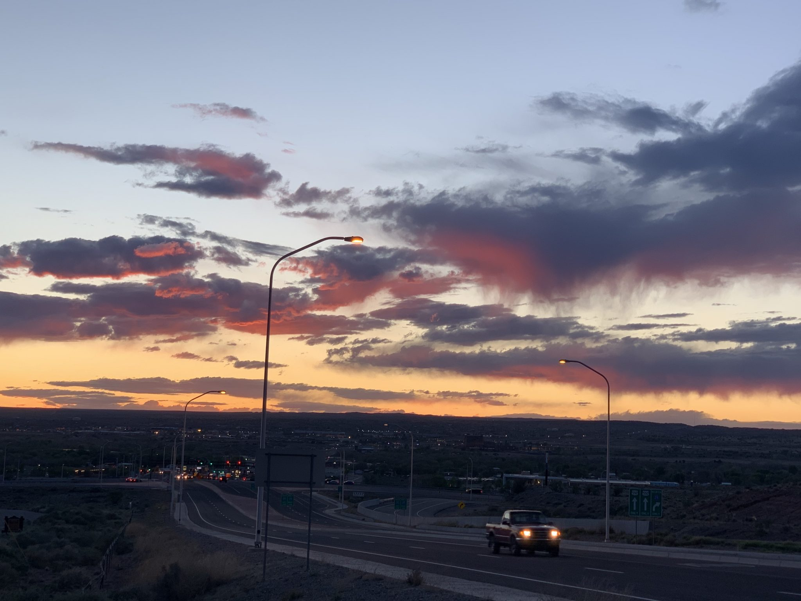
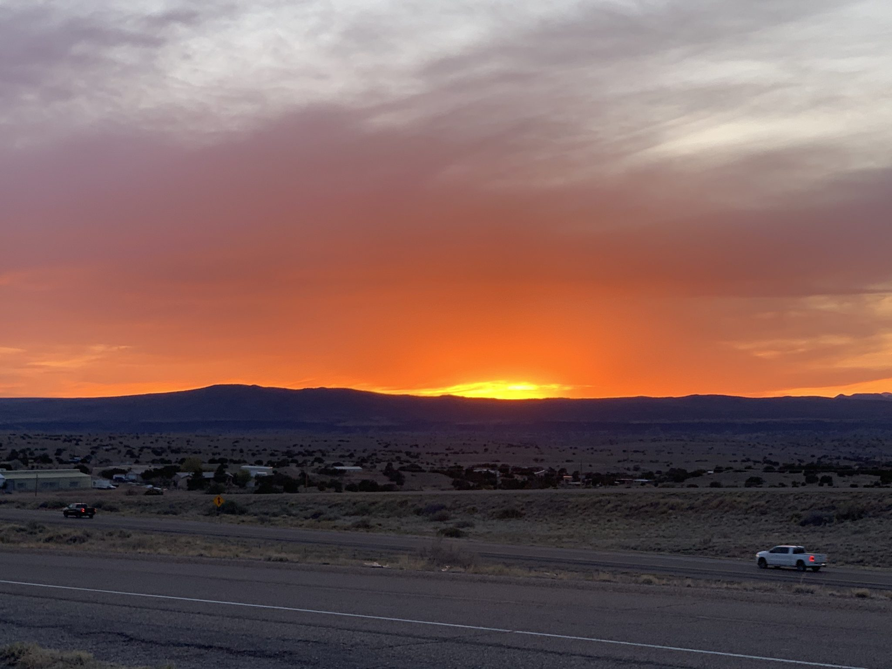
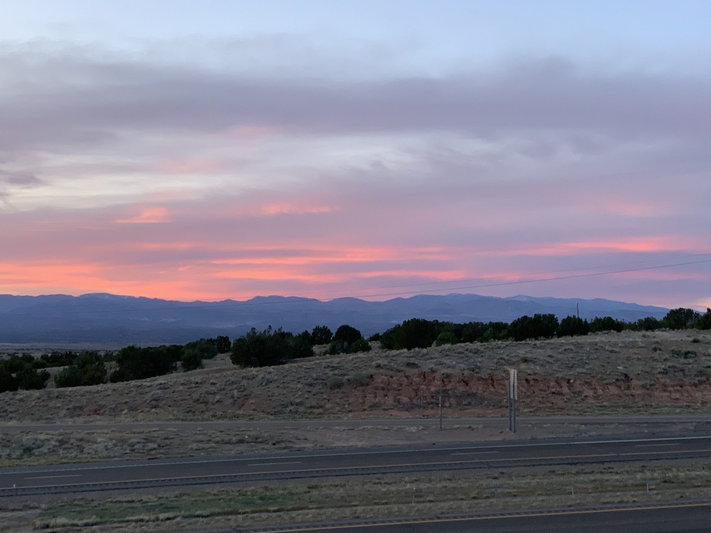

<iframe loading="lazy" allowfullscreen="true" title="New Mexico - Albuquerque and Santa Fe area" width="600" height="600" src="https://www.youtube.com/embed/1sBCI2aVjz8?feature=oembed&amp;color=red&amp;rel=1&amp;controls=1&amp;fs=1&amp;iv_load_policy=0&amp;autoplay=0&amp;modestbranding=0&amp;cc_load_policy=0&amp;playsinline=1" frameborder="0" allow="accelerometer; encrypted-media;accelerometer;autoplay;clipboard-write;gyroscope;picture-in-picture clipboard-write; encrypted-media; gyroscope; picture-in-picture; web-share" referrerpolicy="strict-origin-when-cross-origin"></iframe>

Brent heads onward to New Mexico while Tayler remains with her parents back in the Dallas area. In our previous episode, Tayler had gone back to seek treatment for pain issues she was having related to a cough. Not much could be done due to the covid lockdowns at the time, so she rejoins Brent. We then get take in some sights around Albuquerque and Santa Fe. It was very locked down at the time, but at least we were able to get in to the KOA in Bernalillo.

## Headed to New Mexico

Dates: **March 29- April 25, 2020**

RV Park: _**Albuquerque North/ Bernalillo KOA Journey**_

Our next stop in our adventure West was north of Albuquerque to Bernalillo! Brent originally was supposed to fly out to Minneapolis for work, so we wanted easy access to a large airport for him.  He luckily never had to travel up there thanks to Covid-19.  With me still trying to heal in Dallas, Brent traveled there by himself! It was a 8 hour drive for him and would be his first time pulling the rig by himself! Luckily, it was smooth and he didn’t encounter any problems!

After a week of physical therapy, and medications to help with the pain, the doctors felt time and rest were the only treatments left for my healing. This meant I would be able to rejoin Brent in New Mexico for our travels but would need to take it very easy! Brent agreed to meet me, my mom and my sister at the halfway point of the drive to transfer me over to him to continue with him on our journey across the country!

For our month stay in the Albuquerque area, we stayed at the Albuquerque North/Bernalillo KOA Journey. Originally I thought we would be in a long, pull thru site on the left side of the park but it seems they don’t like to use those sites for the lengthier stays. Our site, P04, was a bit more SNUG than we anticipated, and we ended up barely fitting the truck and the rig in the allotted spot but we made it work! Even though we were a little cramped it was a decent campground. The outdoor decor was cute but most of the amenities were closed with Covid-19.

Not so sure we would want to stay there again but the park’s central location to things we wanted to see in the area and the view of the Sandia Mountains for our time there couldn’t be beat! 

During our time there we had a few things on our To Do list!

-   Santa Fe
-   Pecos National Historical Park
-   Petroglyph National Monument
-   Our own Breaking Bad Tour

This episode we go to the first 2 on the list- Santa Fe and Pecos National Historical park! With me still healing from the rib pains, I still needed to take it pretty easy but really wanted to see around New Mexico! We also took some hikes by the Sandia Mountains, made some food in our little kitchen, and enjoyed some pretty sunsets!

With it’s easy, across the highway, access to hikes next to the Sandia Mountains we tried to take advantage as many times as my rib pains would allow! While I was still in Dallas, Brent was able to scope out some of these trails ahead of time! What pretty, long range views we were able to see! It was a nice change to see mountains…. we DEFINITELY weren’t in Texas anymore!

And check out these beautiful sunset colors!!

## Pecos National Historical Park

On our first weekend there we decided to head north to take a hike through Pecos National Historical Park and then drive to downtown Santa Fe.  At Pecos, we decided to hike a couple miles at the Ancestral Sites Trail that weaves around some ancestral sites of the Pecos Pueblo, including a mission church.  Surrounded by beautiful views of the Sangre de Cristo mountains, this hike was quite peaceful and uninhabited .  With most national parks, or rather parks in general,  closed due to covid 19 restrictions, it was nice this historical park was open for us to enjoy its’ beauty.

## Santa Fe

 After our walk, we thought we would go see what Santa Fe had to offer…. but sadly covid had turned it to quite the ghost town.  What has been known as a lively city, full of culture and great shops, had been deserted.  With nothing open, we didn’t end up staying for very long.  All we were able to do was walk around the empty town square, see beautiful churches and window shop all the closed stores that had beautiful carvings and sculptures outside.  We look forward to eventually going back again to get the true Santa Fe experience, but we will have to settle on just our “peek” at it for now!

Once we decided we had walked around enough, we decided to head back home. On our way home we noticed a monument off the highway. It was the Mormon Batalion Monument!

This monument was off the highway just randomly in the middle of nowhere! This won’t be our only time that we come across a Mormon Battalion Monument either!