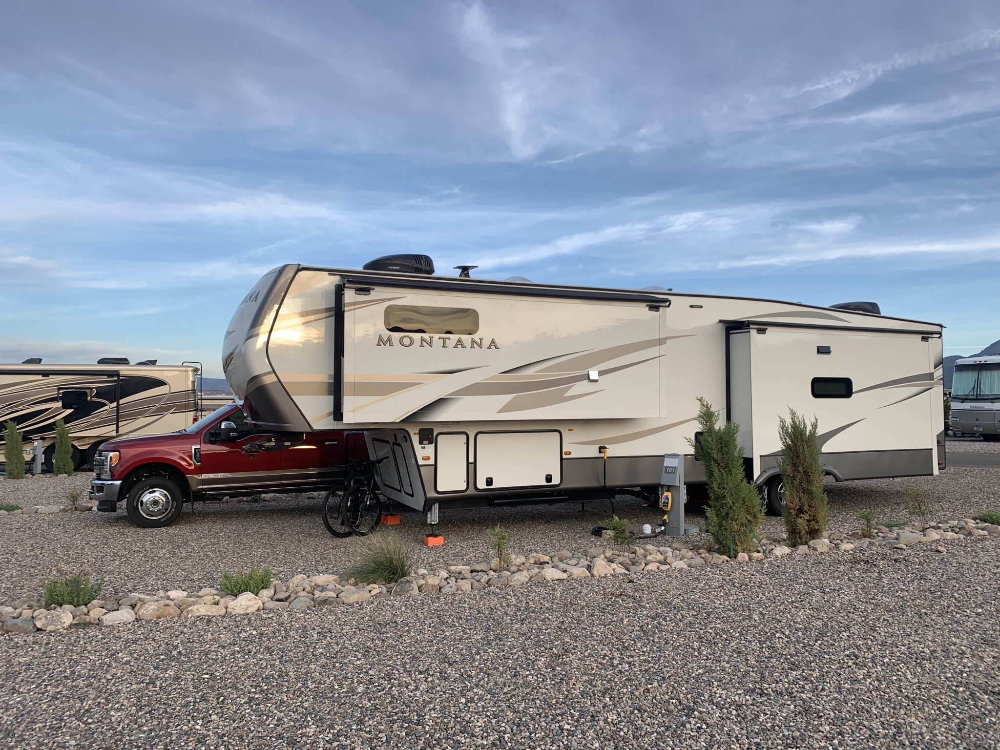
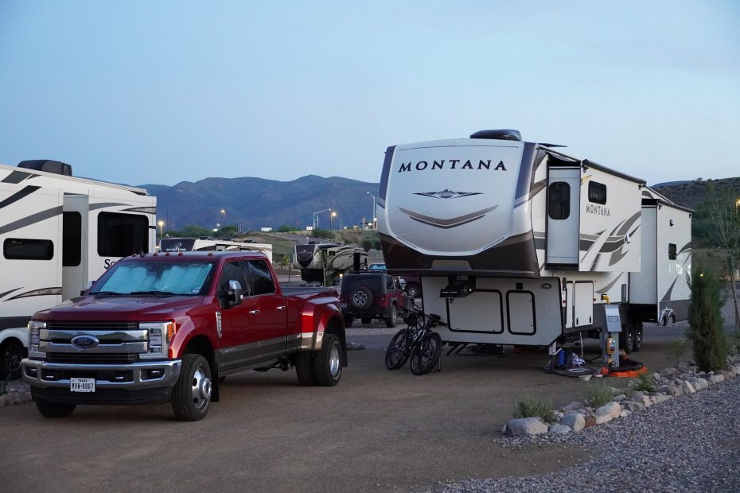
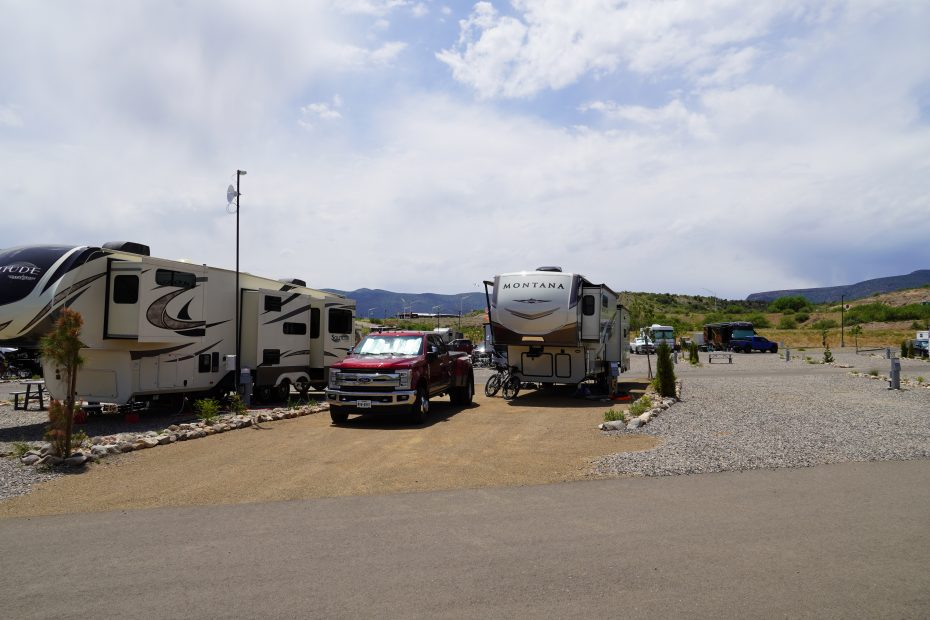
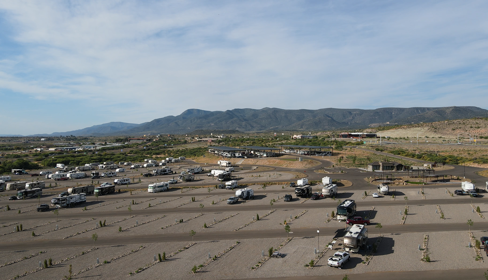
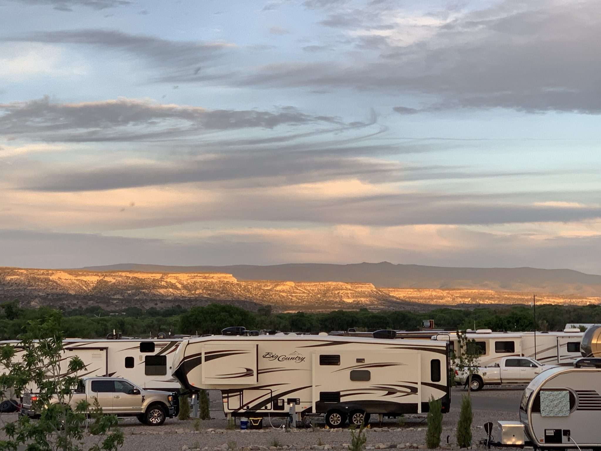
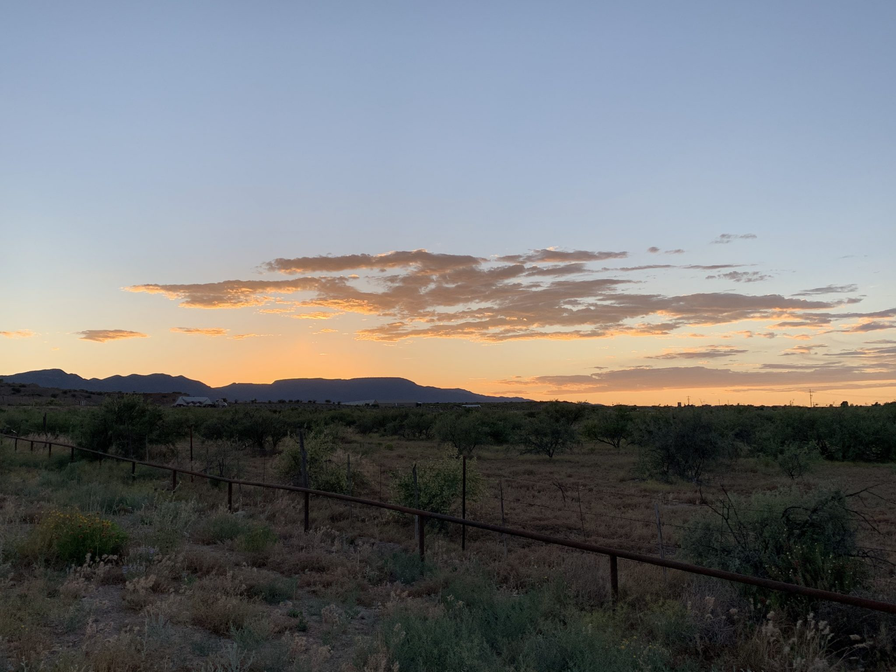
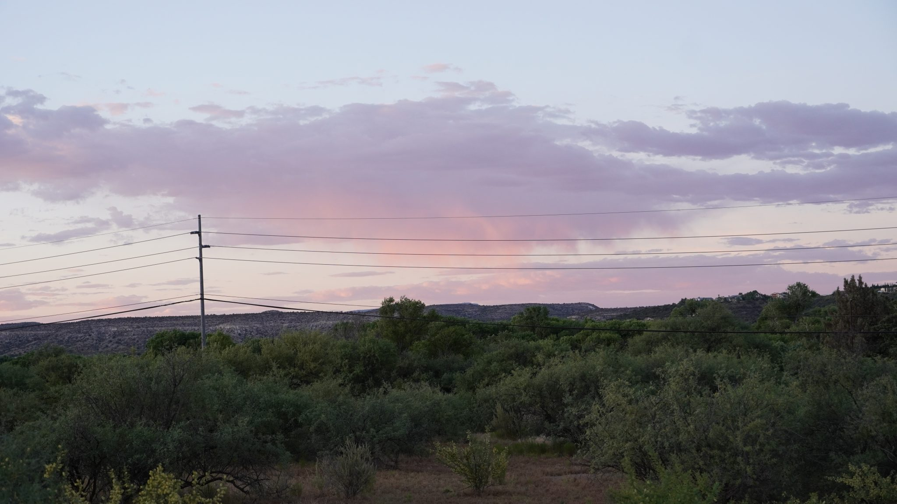
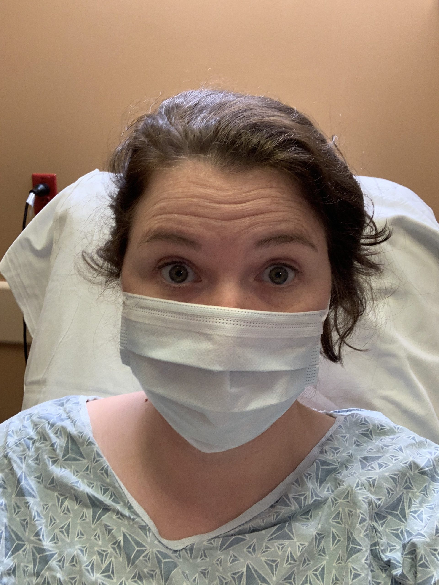
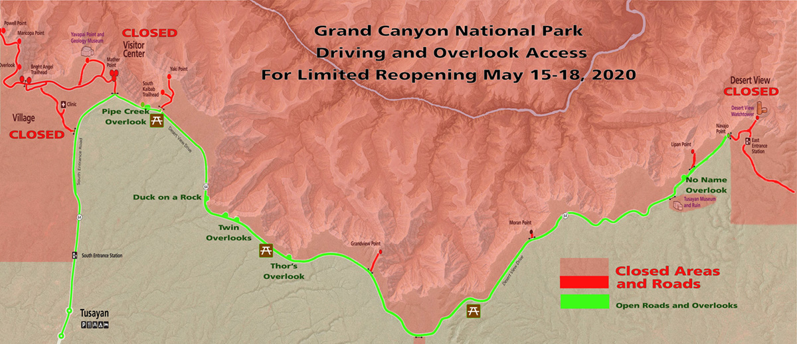

<iframe loading="lazy" allowfullscreen="true" title="Moving on to ARIZONA!  Verde Ranch RV Resort, Grand Canyon, Medical Treatment in Phoenix, and More" width="600" height="600" src="https://www.youtube.com/embed/gg37Pp9ECj8?feature=oembed&amp;color=red&amp;rel=1&amp;controls=1&amp;fs=1&amp;iv_load_policy=0&amp;autoplay=0&amp;modestbranding=0&amp;cc_load_policy=0&amp;playsinline=1" frameborder="0" allow="accelerometer; encrypted-media;accelerometer;autoplay;clipboard-write;gyroscope;picture-in-picture clipboard-write; encrypted-media; gyroscope; picture-in-picture; web-share" referrerpolicy="strict-origin-when-cross-origin"></iframe>

.ose-youtube.ose-uid-8c5153e1f0243009a5bcada4a6b0ae0f { width: 848px !important; height: 480px!important; max-height: 480px !important; max-width: 100%; } .ose-youtube.ose-uid-8c5153e1f0243009a5bcada4a6b0ae0f>iframe { height: 480px !important; max-height: 480px !important; width: 100%; position: relative !important; } .ose-uid-8c5153e1f0243009a5bcada4a6b0ae0f .wistia\_embed { max-width: 100%; } .alignright .ose-wistia.ose-uid-8c5153e1f0243009a5bcada4a6b0ae0f{ margin-left: auto; } .alignleft .ose-wistia.ose-uid-8c5153e1f0243009a5bcada4a6b0ae0f{ margin-right: auto; } .aligncenter .ose-wistia.ose-uid-8c5153e1f0243009a5bcada4a6b0ae0f{ margin: auto; } .ose-uid-8c5153e1f0243009a5bcada4a6b0ae0f img.watermark{ display: none; } .ose-matterport.ose-uid-8c5153e1f0243009a5bcada4a6b0ae0f { position: relative; width: 848px !important; height: 480px !important; max-width: 100%; } .ose-giphy.ose-uid-8c5153e1f0243009a5bcada4a6b0ae0f img{ position: relative; width: 848px !important; height: 480px !important; max-width: 100%; }

Heading on from New Mexico, in this video we move to the incredible Verde Ranch RV Resort. This is a great location between Phoenix and Flagstaff. This allowed us to seek treatment for Tayler’s ongoing pain, getting some answers and a path toward healing by visiting doctors in Phoenix.

It also then allowed for us to have good access to a number of other things to see and do: The Grand Canyon, Meteor Crater, Flagstaff and various volcanic fields and sights around it, Sedona, and Phoenix. This is the great thing about full time RV travel! We get to be closer to so many things for when the work day is done or when we have time on weekends!

## Arizona

Location: Camp Verde

## RV Park: _Verde Ranch RV Resort_

With the New Mexico chapter of our journey ending, it was time to continue west to Arizona. I found a very nice new RV park for us to stay located in Camp Verde, named Verde Ranch RV Resort. What a MASSIVE RV park! With 389 RV spots and 16 cabins, this was by far the largest RV park we had visited to this point! Not only were the spots extremely large, at 75′ x 30′, but it was the first RV park we stayed at that had a true resort feel. Their amenities included a club house, pickleball courts, pool with a hot tub, fitness center, walking paths and so much more! Unfortunately, with our arrival during the Covid-19 pandemic, these extra luxuries of the park weren’t open during our stay. Oh well! Next time we stay here, maybe they will be open! While it was a bummer we couldn’t fully experience the park, the closures gave us more time to just relax outside our RV and enjoy the beautiful scenery around us!

Another plus for this RV park was location! With its convenience right off a main highway and central location, it was ideal for easily accessing cities nearby we wanted to visit. Sedona was only a 45 minute drive away, the Grand Canyon was a couple hours North, Flagstaff was an hour north and then Phoenix was an hour south. Even though it was a bit of a drive to each of those, we tried to take full advantage and see the sights as much as possible!

## Update on Tayler’s Ribs

During this time, I was still dealing with a considerable amount of rib pain. I was told it was most likely pains in my rib muscle that just required alot of rest to heal… but my pain levels were getting to be unbearable. In the past, I had been through similar pain and the only remedy I found was getting a steriod shot. Could that be the solution now as well? We would only be in the area for a few weeks, so I had to be quick if I was to get anything done. After some research, I found a well-rated pain management specialist, in Phoenix, that I was able to discuss my situation as well as my time predicament. Thankfully, he saw the urgency in my pain, and fit me into his schedule for later that week to have an injection. If Dallas had not halted elective procedures, due to the rising Covid numbers, while I was in town, I would’ve had this done before I rejoined Brent on the road. That was not the case, though, so I had to wait a few extra months until we got to Arizona. Luckily, Arizona never stopped those procedures.

Sadly, the injection didn’t help. My next course of action, was to see if a chiropractor could alleviate my pain. The pain specialist gave me a referral to someone local, Dr. Dende, and I was able to meet him the same day! For the first time, during this whole fiasco, I felt like Dr. Dende REALLY listened and helped me find the root of the problem! After an evaluation, he felt this pain wasn’t muscular, but rather from a specific rib bone. So that afternoon I was sent to get a rib series x-ray (an xray that gets different angles of the ribs), and was told I would only get a phone call if they found something wrong. Sure enough, I got a call that night saying they could see signs of healing to a non-displaced rib fracture that the original chest x-ray missed. To say I was relieved, is an understatement. While it was GREAT news to have some answers, the bad news was to hear that it would still be 12 weeks MINIMUM for my pain to start to subside.

Originally, we were only going to be in the area for a couple weeks but last minute we changed our plans! Needles, California, which was our next stop, was expecting insane temperatures around 116 those next couple of weeks, so rather than move there we decided to remain in Camp Verde, where I would continue to focus on my healing. During our extension, Dr. Dende wanted to provide adjustments and therapy to my rib 3 days a week, every MWF, to speed up my healing. We scheduled my appointments around Brent’s work hours in case the treatments caused me too much discomfort that I wasn’t able to drive myself back. This meant most our nights, during that period, would be consumed with two-hour round trips, since he was located in Phoenix. I know it was alot of drive time but I was very thankful for this extra time to focus on getting me back to normal! By the end of those three weeks, I could definitely tell my body was moving in the right direction and that the therapies were helping.

## Grand Canyon

Not only did our postponement of travel benefit my healing, it also allowed the perfect amount of extra time for the Grand Canyon and the Meteor Crater to FINALLY reopen to visitors! Up until this point, national parks and other large attractions had been closed to slow the spread of Covid-19. After months, they were slowly reopening, with the last standout being the Grand Canyon. Since neither of us had ever been there, we knew if it was open, we were ABSOLUTELY going! For its initial phased opening, ONLY the South Rim South Entrance would be open for incoming traffic for a four day window, during the hours of 6-10am. However, once in the park you could stay the whole day until sunset. So, that first morning it opened, we hopped in the car at 4:30am to make the two and a half hour drive there!

For our visit, they allowed visitors to drive their vehicles to only six different viewpoints off Desert View drive, between Pipe Creek Vista and Najavo Point. We would just have to settle for the views this visit, as hiking trails were not open to hikers below the Rim. Though this was no where near the full national park experience, we were just thankful and excited to have the opportunity to get a glimpse of the Grand Canyon for the first time! What a stunning canyon!!! From the canyons depth to its vast size, it is absolutely incredible and photos definitely don’t do it justice!! I can see why it is one of the seven wonders of the world! Once we soaked in the views at one viewpoint, we would drive to the next one. Each viewpoint allowed us to see its’ beauty from a different perspective. It’s crazy how unreal and unbelievable our photos look, like they were photoshopped, when in fact they are truly 100% real.

After spending several hours enjoying the views, we reached the last viewpoint, Najavo Point. From here, we were directed to turn around and exit back through the Southern entrance. Since Najavo nation had been hit hard with Covid-19, the east entrance was to remain closed. We thoroughly enjoyed our first time visiting the Grand Canyon. What a remarkable national park! Even though this was just a “taste” of all this national park has to offer, it was worth seeing in person! We look forward to returning when all the park amenities are fully opened, including the Grand Canyon Village, the visitor center and the shuttle bus that takes you to viewpoints down Hermit Road. Until then, we can reminisce on our experience through our amazing photos.

Grand Canyon Brewery

After we left the Grand Canyon, we decided to finish our day at the Grand Canyon Brewery in Flagstaff. Not only were the drinks fantastic, but the food was very delicious as well. I highly recommend getting a burger from there! If you end up in the Flagstaff area, or the Williams area, they have two different locations that are well worth a stop. We actually enjoyed our first experience there so much, that we had to make a second pit stop there before we left the area! We even bought shirts from there!