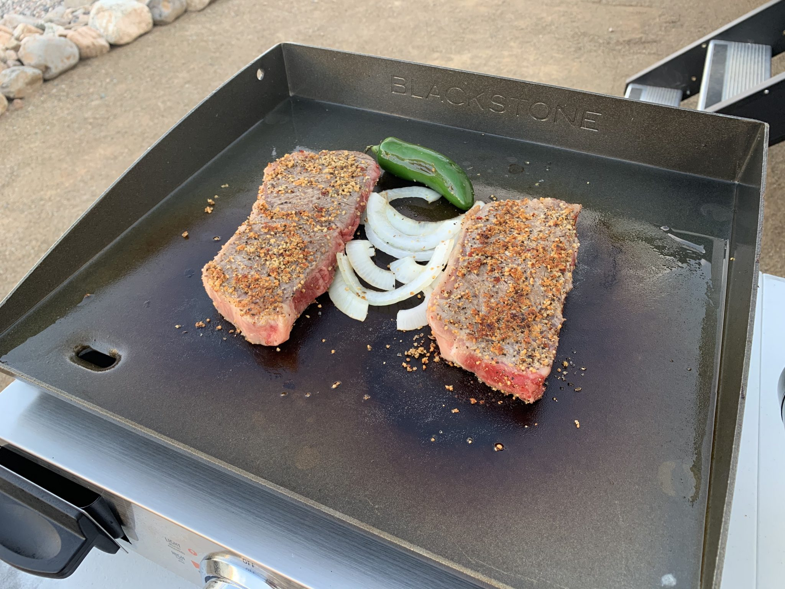

<iframe loading="lazy" allowfullscreen="true" title="A meteor left this giant hole in Arizona - She drives the RV for the first time" width="600" height="600" src="https://www.youtube.com/embed/ZnxyXd7WYyk?feature=oembed&amp;color=red&amp;rel=1&amp;controls=1&amp;fs=1&amp;iv_load_policy=0&amp;autoplay=0&amp;modestbranding=0&amp;cc_load_policy=0&amp;playsinline=1" frameborder="0" allow="accelerometer; encrypted-media;accelerometer;autoplay;clipboard-write;gyroscope;picture-in-picture clipboard-write; encrypted-media; gyroscope; picture-in-picture; web-share" referrerpolicy="strict-origin-when-cross-origin"></iframe>

Meteor Crater is basically a giant divot that was punched into the earth by a meteor. This is unlike most other craters that you will encounter on earth, which are most likely to have been created by volcanic activity. They have an incredible visitor center where you can learn more about the impact event, the meteor, the efforts to mine resources from it, NASA and Hollywood’s usage of the site, and more. They also offer tours along a portion of the ridge and plenty of viewing opportunities on various decks. We weren’t sure what to expect in visiting a hole in the ground, but the visitor center and guides along with the views really made it worth the stop!

One of the other popular attractions that opened in Arizona during our time extension was the Meteor Crater! But before we go visit, we wanted to make dinner on our newly purchased 17″ Blackstone grill. We were excited to use it and the weather made for a perfect grilling night. This grill expanded our cooking capabilities while we traveled. Instead of having a large grill with legs, this tabletop option allowed for more grilling flexibility and was easier and smaller to keep in storage. For our first use, Brent decided he would grill some juicy steaks and grilled onions! The grill ended up working fantasic and the food was delicious!!!

Meteor Crater Visit

The next morning we made the drive to visit the Meteor Crater! Since it was only open at 50% capacity for the opening weekend, I made sure to get our tickets online before we arrived. For those that don’t know, the Meteor Crater is a giant bowl cavity on earth’s surface, east of Flagstaff, that measures 550ft deep and almost a mile in width. Roughly 50,000 years ago, a meteorite consisting of iron and nickel, with a width of 150 feet and a weight of about 300,000 tons, collided with the earth going 26,000 miles per hour. The impact was so massive, it was about 150 times the force of the atomic bomb! It even overturned and inverted the layers of strata within the crater. This means the rock layers are stacked in reverse order than they occurred naturally, with the oldest layers (from 265 million years ago) on top.

Thankfully, the crater has had limited erosion and been well preserved, due to the desert climate, so visitors are able to come enjoy this unique national landmark. In the early 20th century, the Barringer family not only purchased the crater and the land surrounding it, but they filed mining claims to it as well. Since Daniel Barrienger was the first to suggest the crater formed from a meteorite’s impact, the crater is also referred to as the Barringer Meteorite Crater. Unless you go and visit in person, you never truly will understand the massive scale of this crater. It is incredible to see. Once there, you have the option to view the crater by an indoor viewing area, observation decks, self-guided trails or you can take a guided tour along the rim. Be cautious of the wind if you do take the guided tour! They can be quite strong and took people’s hats off!

Our guide was extremely informative! Not only did he explain the history of the crater, but he also shared some experiences that have happened over the years. 1964 there was a small plane that crashed. The winds were so strong after crossing the rim that they couldn’t maintain their altitude and crashed. Thankfully the pilots survived To this day, there is still a small portion of the plane’s wreckage that can still seen with binoculars.

Along with getting to see the crater, you can also explore the Meteor Crater Visitor Center, which is on the rim of the crater. Within the center, they have an incredibly detailed discovery and space museum, which includes artifacts and many interactive displays on meteroites, asteriods, space, and the solar system. I even got to touch part of an actual meteorite! This is an awesome educational museum!! You learn quite a few fascinating facts. One of those facts was that NASA astronauts actually trained in the crater, during the 60s and 70s, to prepare for their Apollo missions to the moon. The crater surface was the closest to what the astronauts would encounter on the moon.
